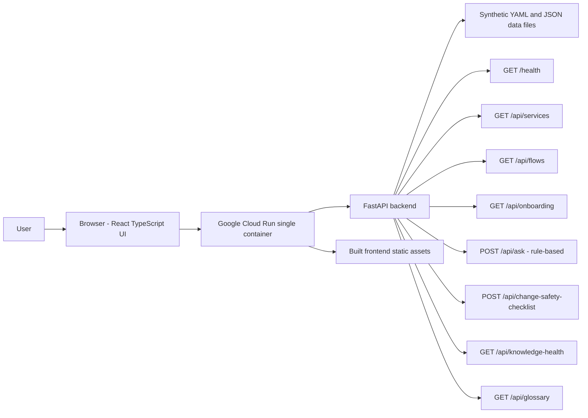

# Architecture

## 1. MVP Architecture Overview

Payments Platform Navigator is a single-container MVP designed for Google Cloud Run.

The application consists of:

- React with TypeScript frontend.
- FastAPI Python backend.
- Local YAML and JSON synthetic data files.
- One Docker image containing backend, frontend static assets, and data files.
- No database, authentication, external AI model, private network, Kubernetes, or real integrations for MVP.

The backend serves API responses from the synthetic data model. The frontend consumes those APIs to render role-based onboarding, payment flow exploration, service dependency navigation, rule-based Ask the Platform, change-safety checklists, knowledge-health metrics, and glossary search.

## 2. Repository Structure

Expected MVP structure:

```text
payments-platform-navigator/
  AGENTS.md
  README.md
  data/
    services.yaml
    payment-flows.yaml
    event-catalogue.yaml
    api-catalogue.yaml
    runbooks.yaml
    incidents.json
    change-records.json
    test-coverage.json
    glossary.yaml
    onboarding-paths.yaml
    knowledge-health.json
  docs/
    product-brief.md
    decision-log.md
    ui-design.md
    api-contract.md
    demo-script.md
    architecture.md
  backend/
    app/
      main.py
      data_loader.py
      routers/
      schemas/
  frontend/
    src/
      components/
      screens/
      api/
      types/
  Dockerfile
```

The exact implementation folders may evolve, but the MVP should preserve clear boundaries between docs, data, backend, and frontend.

## 3. Data Loading Approach

The backend loads local files from `data/` at startup or through a cached loader.

Data rules:

- YAML files are parsed with a YAML parser.
- JSON files are parsed with the Python standard JSON library.
- No string parsing of structured data.
- IDs remain stable and are used for joins across files.
- The loader should expose indexed lookups by service ID, flow ID, API ID, event name, runbook ID, incident ID, change ID, test ID, glossary term, onboarding role, and knowledge-health ID.
- Missing linked records should not crash the whole application. API responses should surface unresolved references where useful.
- Data is read-only for MVP.

Join examples:

- Service detail joins `services.yaml` to knowledge-health service entries, incidents, changes, tests, APIs, events, flows, and runbooks.
- Flow detail joins `payment-flows.yaml` to services, APIs, events, runbooks, incidents, changes, tests, and flow-health records.
- Change Safety expands selected services and flows into linked APIs, events, runbooks, incidents, prior changes, tests, known gaps, and health warnings.

## 4. Single-Container Cloud Run Architecture

The Cloud Run service runs one container.

Runtime requirements:

- Listen on `PORT`.
- Default to `8080`.
- Bind to `0.0.0.0`.
- Serve backend APIs and frontend static assets from the same container.
- Avoid hardcoded local-only ports.

Recommended serving model:

- Build frontend static assets during Docker build.
- Copy static assets into the backend image.
- FastAPI serves `/api/*` endpoints and static frontend routes.
- Uvicorn starts FastAPI using `host=0.0.0.0` and `port=${PORT:-8080}`.

## 5. Frontend / Backend Relationship

The frontend owns:

- Navigation and screen routing.
- UI state such as selected role, filters, selected service, selected flow, and local module viewed state.
- Rendering tables, cards, timelines, dependency map, dashboard tiles, and checklists.
- Calling API endpoints defined in `docs/api-contract.md`.

The backend owns:

- Loading and indexing synthetic data.
- Validating request parameters and request bodies.
- Resolving linked evidence.
- Rule-based Ask the Platform logic.
- Deterministic Change Safety Checklist generation.
- Returning consistent error responses.

The backend should not embed frontend-specific layout decisions. The frontend should not duplicate business rules for Ask or checklist generation beyond client-side validation hints.

## 6. Mermaid Architecture Diagram



## 7. Local Development Flow

Recommended local flow:

1. Install backend dependencies.
2. Install frontend dependencies.
3. Run backend locally on port `8080` or another configured `PORT`.
4. Run frontend development server during implementation, proxying API calls to the backend.
5. For container verification, build the Docker image and run it with `PORT=8080`.
6. Verify `/health`, core API endpoints, and static frontend routes.

Local verification should include:

- `GET /health`
- `GET /api/services`
- `GET /api/flows`
- `GET /api/knowledge-health`
- `POST /api/ask`
- `POST /api/change-safety-checklist`

## 8. Deployment Flow

Target deployment:

- GitHub repository.
- Google Cloud Build.
- Container image built from the repository.
- Deployed to Google Cloud Run.

High-level deployment steps:

1. Push changes to GitHub.
2. Cloud Build builds the frontend and backend into one container image.
3. Cloud Build pushes the image to the configured artifact registry.
4. Cloud Run deploys the image.
5. Cloud Run injects `PORT`.
6. The service starts FastAPI bound to `0.0.0.0:${PORT}`.
7. Smoke test `/health` and key UI routes.

## 9. Future Architecture Options

Potential future options:

- Add governed retrieval over a larger documentation corpus.
- Add external AI only after source grounding, citation, refusal, and synthetic/public-data controls are designed.
- Add a graph database if dependency traversal becomes too complex for local files.
- Add authentication if the project is adapted for a private enterprise environment.
- Add integration with issue trackers, CI systems, runbook repositories, and incident tools.
- Add documentation freshness checks from repository metadata.
- Add export of change-safety evidence to pull requests or change records.

These are intentionally out of scope for MVP.

## 10. Security and Data-Safety Notes

The public repository must use synthetic data only.

Do not include:

- Real bank names.
- Real service names.
- Real people.
- Real internal architecture.
- Real incidents.
- Real operational procedures.
- Customer data.
- Payment data.
- Credentials.
- Secrets.
- Confidential implementation patterns.

MVP controls:

- Data files carry synthetic classification metadata.
- API responses should not claim production readiness.
- Ask the Platform must answer from local synthetic data only.
- Checklist output is guidance for a demo and not a production approval workflow.
- No external systems are called.
- No user data is persisted.

The architecture is intentionally conservative: one container, local read-only data, deterministic APIs, and no private dependencies.
